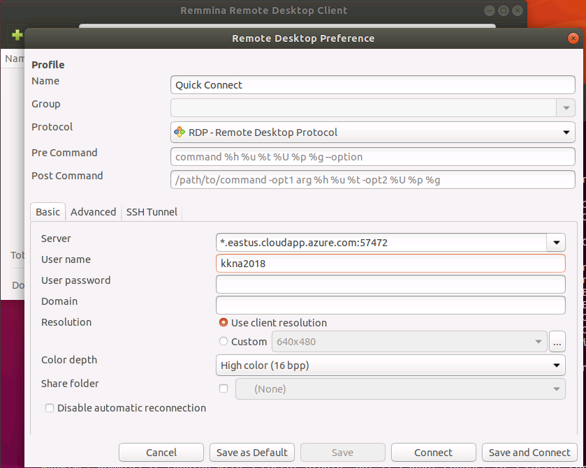

# Kubecon Windows Lab VMs

There are a bunch of VMs set up with the software needed to run these demos. If you want to try this yourself today during the conference, follow the steps below. This was set up as a classroom lab using [Azure Lab Services](https://docs.microsoft.com/en-us/azure/lab-services/classroom-labs/classroom-labs-overview). 
The scripts used to customize the VMs are available at [PatrickLang/KubernetesForWindowsTutorial](https://github.com/PatrickLang/KubernetesForWindowsTutorial/tree/master/LabVm)

1. Get a Windows remote desktop (RDP) client:
  - Mac – https://aka.ms/rdapps 
  - Linux - Search for 'remmina' with your package manager or install [FreeRDP](http://www.freerdp.com)
  - Windows - it's built-in (mstsc.exe)
2. Browse to https://labs.azure.com/register/0mtpnnp7 , and complete signup if you don't have an account registered with Azure. This doesn't create a paid account, it's only a login for the lab. If you already have an Azure account, accessing this lab won't charge you anything.
3. Look for the VM called 'kkna2018-lg'. If Connect is greyed out, click Start and wait a few minutes
4. Click Connect. If you're on Windows or Mac, the browser should ask if you want to open the RDP file with Remote Desktop. If on Linux, save it to disk, then read [Using Remmina](#using-remmina)
5. Log in with username: `kkna2018`, password `7HandledWheel!`


## Using Remmina

I have found conflicting stories of whether Remmina should work with RDP files or not, but it didn't work for me on Ubuntu 18.04.1. The RDP file is just a simple `key:type:value` structure, so it's easy to find the connection string.


Example RDP file

```none
full address:s:ml-lab-guid.eastus.cloudapp.azure.com:57472
prompt for credentials:i:1
username:s:~\kkna2018
```

Create a new session in Remmina and copy the FQDN and port number after `full address:s:` . Be sure to choose Color Depth: `High Color` for best compatibility. The AVC modes require `libfreerdp` to be compiled with h.264 support which isn't in Ubuntu's snap.

